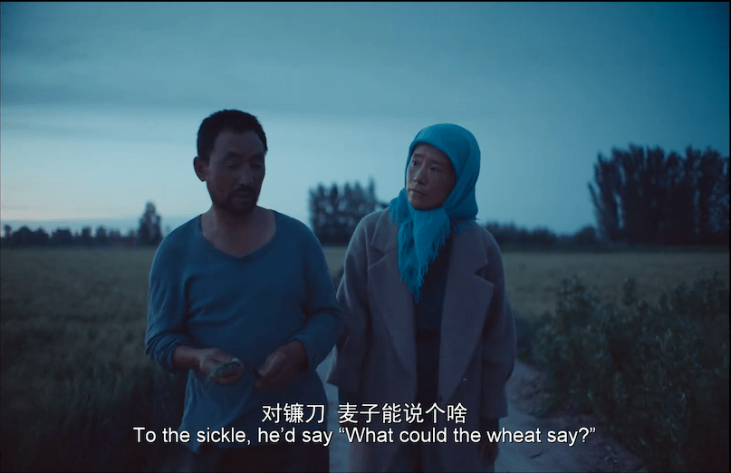
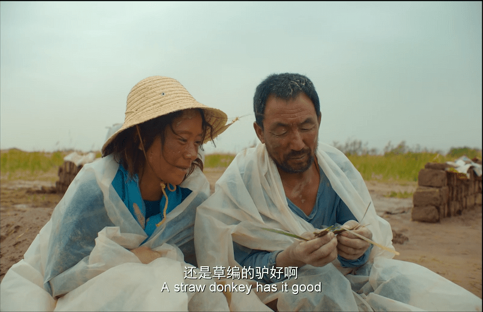
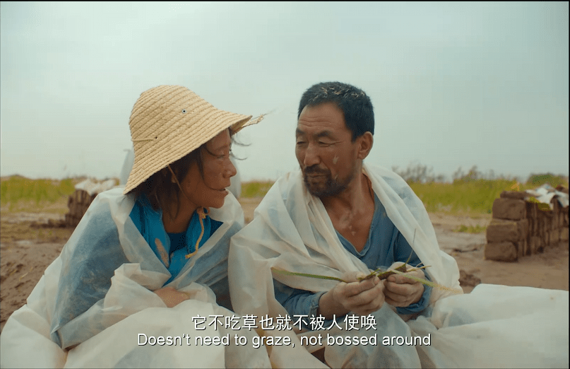

　　虽然几个月前就上映了，可今天才看了这个电影，我是在得知它被禁后才来看的。实在是看不出一点被禁的理由，非要说，那就是：皇帝太善良了，看不得人间的苦难，所以要我们蒙上眼睛。

　　电影本身很平淡，像是什么都没说，可什么又什么都说了（不然为啥被禁？）

　　平淡的是故事本身，一个农村贫农的生活：献血给村霸（最后他儿子还拿了一万五的拆迁补贴）、娶妻、爱妻、对未来充满热情、妻子离世、政府补贴的楼房、自杀（？可能不是，我从镜头语言里看出来的）。我看到有一些评论在说农村人没那么冷血，会去救落水的曹贵英；还有人在说现在农村没那么贫困了，故事缺乏真实性，等等。对此我只能说，一千个读者有一千个哈姆雷特，我尊重你的解读，但你没必要到处“宣传”你的“正确”见解。关于电影里苦难的真实性，我想借用俄国作家托尔斯泰曾说过的一句话：“幸福的人是相似的，不幸的人各有各的不幸”。我上小学之前“有幸”在农村住过五六年，再结合主人公是个很贫困的农民，也差不多就是写实了吧；而且电影也没有指明是哪个时间点的剧本，我觉得封掉它的人也没必要因为苦难这么敏感，这里的苦难可没有建国前革命烈士的故事更催人泪下。

　　为什么我又觉得它什么都说了呢？从普通人对人生的思考角度来看，它用镜头语言讲了很多。普普通通的劳作、男女主彼此的关心慰藉、从村里疯子口中传出的很有哲理的话、一次次抽出去的血、和村里人的人际关系、放生后又回来的毛驴、那朵开在心底的小麦花，它们无不在诠释着生命的顽强与美好。电影结尾也很棒，开放式结局，有说马有铁和侄子住一起了，也有镜头里的那一瓶农药，还有一些自杀前的铺垫（还清了借的十个鸡蛋、卖了所有的玉米、还有妻子死后杀的鸡）。

　　从苦难的角度，到自杀这种沉重的话题，于情于理都不该禁。中国的扶贫效果很显著，这点我深有体会，还住在农村的外公，拿了国家的补贴把房子和院子都修得很漂亮，院子里有一两百平米的地种了蔬菜，每月还有发的一百块补贴，哦对，还有免费的WiFi！差不多有20Mbps吧，我们家的移动WiFi每年150，是100Mbps带宽的，也不贵吧，可是外公是在农村哎，还是山里，能上网就很神奇了！扶贫这一点中国政府做的很好！也不怕别人抹黑好嘛。

　　我觉得电影重点应该是想说关于人生的思考，换做我失去了爱人，我可能也会绝望到自杀吧，毕竟有铁又没有什么爱好，活下去就很累了，生活又没有一点颜色，真不如了结了。最后，我想说，同志们，让我们为自己的理想而奋斗吧，纵使压力和阻挠重重，未来的未来，人类终将迎来彻底的解放！

